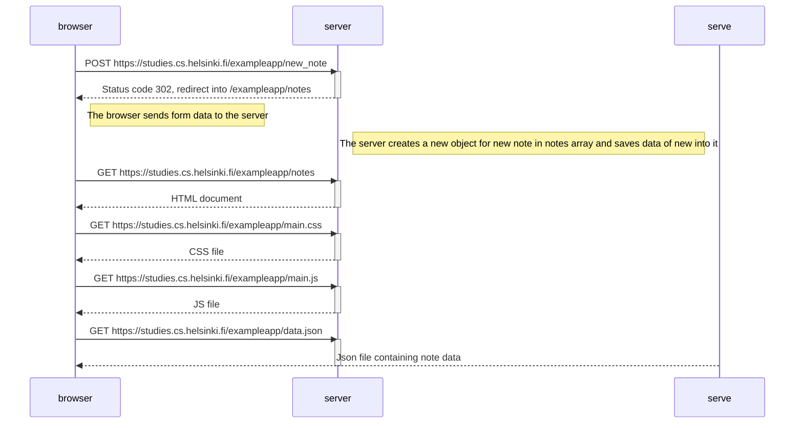

```mermaid
sequenceDiagram
	participant browser
	participant server

	browser->>server: POST https://studies.cs.helsinki.fi/exampleapp/new_note
	activate server
	server-->>browser: Status code 302, redirect into /exampleapp/notes
	deactivate server

	Note right of browser: The browser sends form data to the server
	Note right of server: The server creates a new object for new note in notes array and saves data of new into it

	browser->>server: GET https://studies.cs.helsinki.fi/exampleapp/notes
	activate server
	server-->>browser: HTML document
	deactivate server

	browser->>server: GET https://studies.cs.helsinki.fi/exampleapp/main.css
	activate server
	server-->>browser: CSS file
	deactivate server

	browser->>server: GET https://studies.cs.helsinki.fi/exampleapp/main.js
	activate server
	server-->>browser: JS file
	deactivate server

	browser->>server: GET https://studies.cs.helsinki.fi/exampleapp/data.json
	activate server
	serve-->>browser: Json file containing note data
	deactivate server
```	 
