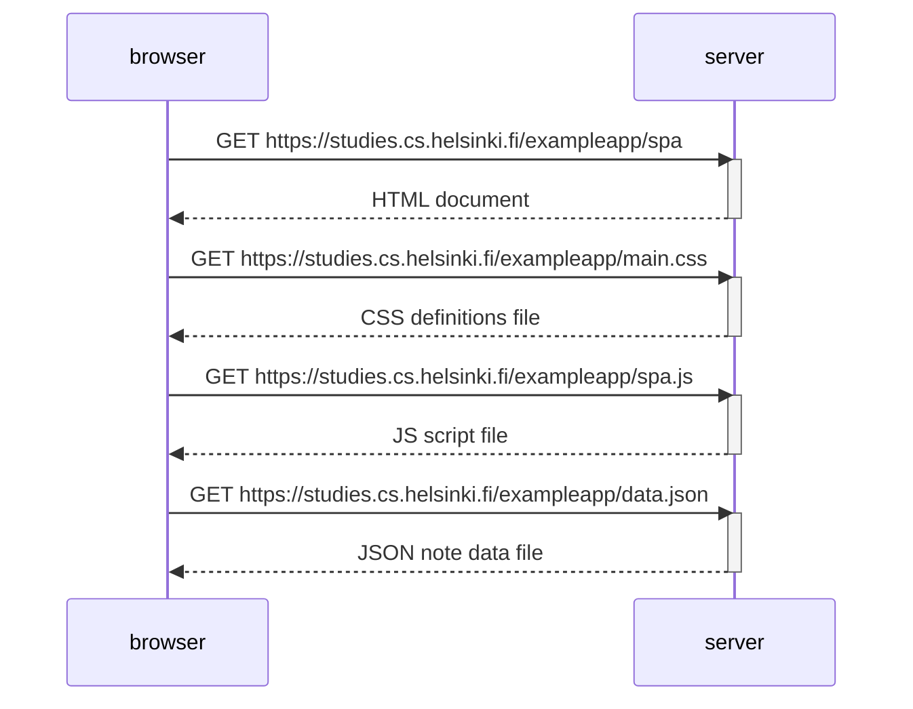

```mermaid
sequenceDiagram
	participant browser
	participant server

	browser->>server: GET https://studies.cs.helsinki.fi/exampleapp/spa
	activate server
	server-->>browser: HTML document
	deactivate server

	browser->>server: GET https://studies.cs.helsinki.fi/exampleapp/main.css
	activate server
	server-->>browser: CSS definitions file
	deactivate server

	browser->>server: GET https://studies.cs.helsinki.fi/exampleapp/spa.js
	activate server
	server-->>browser: JS script file
	deactivate server

	browser->>server: GET https://studies.cs.helsinki.fi/exampleapp/data.json
	activate server
	server-->>browser: JSON note data file
	deactivate server
```
